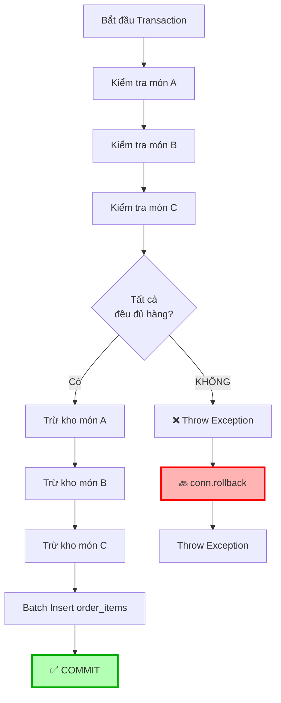
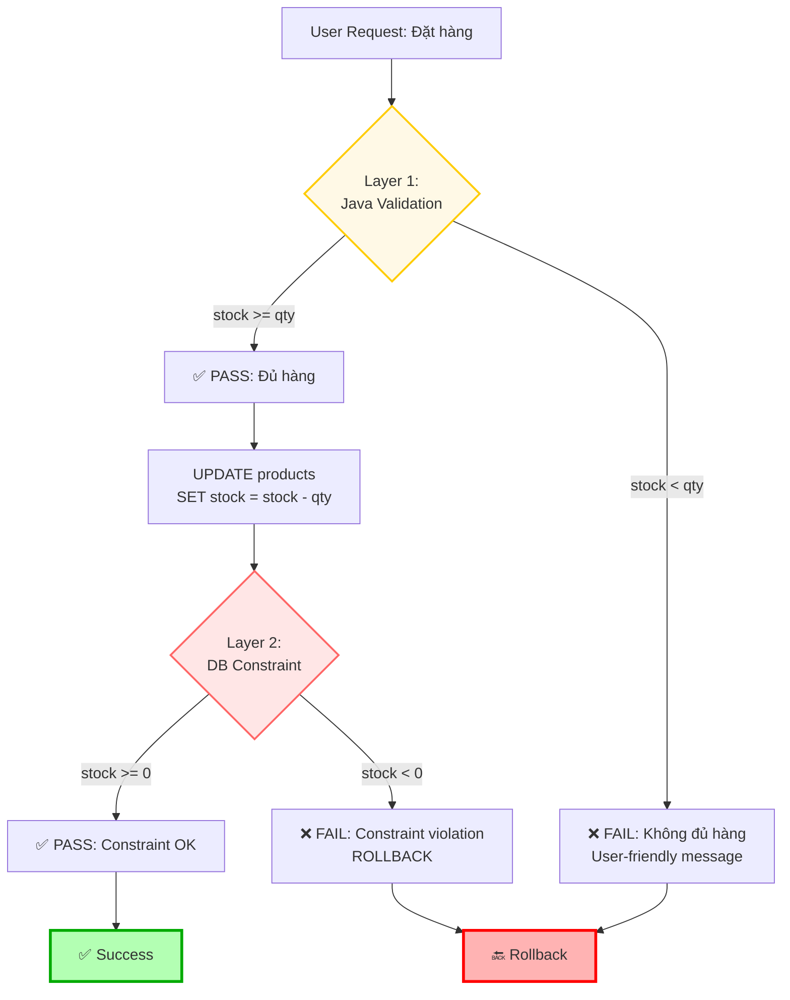

# Câu hỏi và Trả lời - JDBC Transaction & Batch Lab

## Câu hỏi 1: Race Condition & Oversell Problem

### 📋 Câu hỏi:

Kho chỉ còn 1 sản phẩm iPhone 15. Có 2 khách hàng (A và B) cùng bấm nút "Đặt hàng" tại chính xác cùng một thời điểm (mili-giây).

**Câu hỏi**: "Làm sao nhóm đảm bảo không bị bán âm kho (oversell)? Nếu code của bạn hoạt động theo quy trình: 
- B1: Lấy số lượng tồn kho (SELECT) 
- B2: Kiểm tra nếu > 0 
- B3: Update trừ kho & Tạo đơn

Thì khi 2 request cùng chạy B1 và thấy còn 1 cái, cả 2 đều qua B2, và cả 2 đều chạy B3. Kết quả kho sẽ là -1. Nhóm xử lý việc này thế nào?"

---

### ✅ Trả lời:

Đây là vấn đề **Race Condition** rất phổ biến trong hệ thống concurrent. Chúng em xử lý vấn đề này bằng **nhiều lớp bảo vệ**:

#### **Giải pháp 1: Database Constraint (Lớp bảo vệ đầu tiên)**

```sql
CREATE TABLE products (
    id SERIAL PRIMARY KEY,
    name VARCHAR(255) NOT NULL,
    stock INTEGER NOT NULL CHECK (stock >= 0)  -- ⭐ CONSTRAINT quan trọng!
);
```

**Giải thích:**
- Constraint `CHECK (stock >= 0)` đảm bảo stock KHÔNG BAO GIỜ âm
- Nếu transaction nào cố gắng UPDATE làm stock < 0 → Database sẽ TỰ ĐỘNG REJECT
- Đây là lớp bảo vệ cuối cùng (last line of defense)

**Demo tình huống:**
```
Tình huống: Stock hiện tại = 1
- Transaction A: UPDATE products SET stock = stock - 1 WHERE id = 2 → stock = 0 ✅ SUCCESS
- Transaction B: UPDATE products SET stock = stock - 1 WHERE id = 2 → stock = -1 ❌ CONSTRAINT VIOLATION

PostgreSQL sẽ throw Exception: "violates check constraint"
→ Transaction B tự động ROLLBACK
```

#### **Giải pháp 2: Transaction Isolation Level**

PostgreSQL mặc định sử dụng **READ COMMITTED** isolation level, nhưng để đảm bảo an toàn hơn, có thể nâng lên **SERIALIZABLE**:

```java
conn.setTransactionIsolation(Connection.TRANSACTION_SERIALIZABLE);
```

**So sánh các Isolation Levels:**

| Isolation Level | Read Uncommitted | Dirty Read | Non-repeatable Read | Phantom Read | Serialization Anomaly |
|----------------|------------------|------------|---------------------|--------------|----------------------|
| READ UNCOMMITTED | ✅ | ✅ | ✅ | ✅ | ✅ |
| READ COMMITTED (default) | ❌ | ❌ | ✅ | ✅ | ✅ |
| REPEATABLE READ | ❌ | ❌ | ❌ | ✅ | ✅ |
| SERIALIZABLE | ❌ | ❌ | ❌ | ❌ | ❌ |

**Với SERIALIZABLE:**
- Nếu 2 transactions cùng đọc và update cùng 1 row
- Transaction nào commit trước sẽ thành công
- Transaction sau sẽ bị ROLLBACK với lỗi "serialization failure"

#### **Giải pháp 3: SELECT FOR UPDATE (Pessimistic Locking)**

Cách tốt nhất để tránh race condition là dùng **row-level locking**:

```java
// Thay vì SELECT thông thường
String sqlCheckStock = "SELECT id, name, stock FROM products WHERE id = ?";

// Dùng SELECT FOR UPDATE để LOCK row
String sqlCheckStock = "SELECT id, name, stock FROM products WHERE id = ? FOR UPDATE";
```

**Cách hoạt động:**

```
Timeline:
T0: Transaction A: SELECT ... FOR UPDATE (id=2) → LOCK ROW 2
T1: Transaction B: SELECT ... FOR UPDATE (id=2) → WAIT (bị block)
T2: Transaction A: UPDATE stock... 
T3: Transaction A: COMMIT → UNLOCK ROW 2
T4: Transaction B: Mới được phép đọc row 2 (với stock đã updated)
T5: Transaction B: Kiểm tra → Phát hiện stock = 0 → ROLLBACK
```

**Kết quả:**
- ✅ Transaction A thành công (stock: 1 → 0)
- ❌ Transaction B thất bại (phát hiện stock = 0, không đủ hàng)
- ✅ KHÔNG BAO GIỜ bị âm kho

#### **Giải pháp 4: Optimistic Locking với Version**

Thêm column `version` vào bảng products:

```sql
CREATE TABLE products (
    id SERIAL PRIMARY KEY,
    name VARCHAR(255) NOT NULL,
    stock INTEGER NOT NULL CHECK (stock >= 0),
    version INTEGER DEFAULT 0
);
```

```java
// UPDATE với điều kiện version
String sql = "UPDATE products SET stock = stock - ?, version = version + 1 " +
             "WHERE id = ? AND version = ?";
             
pstmt.setInt(1, qty);
pstmt.setInt(2, productId);
pstmt.setInt(3, currentVersion);

int rowsAffected = pstmt.executeUpdate();
if (rowsAffected == 0) {
    throw new Exception("Conflict! Sản phẩm đã được người khác mua");
}
```

#### **So sánh các giải pháp:**

| Giải pháp | Ưu điểm | Nhược điểm | Phù hợp |
|-----------|---------|------------|---------|
| **Database Constraint** | Đơn giản, chắc chắn | Chỉ phát hiện lỗi cuối cùng | ✅ BẮT BUỘC có |
| **SERIALIZABLE** | Tự động handle conflicts | Performance thấp hơn | ⚠️ Hệ thống nhỏ |
| **SELECT FOR UPDATE** | An toàn, hiệu quả | Blocking (có thể deadlock) | ✅ KHUYẾN NGHỊ |
| **Optimistic Locking** | No blocking, high performance | Phải retry khi conflict | ✅ High concurrency |

### 🎯 Giải pháp của nhóm:

**Chúng em áp dụng kết hợp:**

1. ✅ **Database Constraint** (`CHECK (stock >= 0)`) - Lớp bảo vệ cuối cùng
2. ✅ **Transaction** với READ COMMITTED (default)
3. ✅ **Validation trước khi UPDATE** - Fail fast strategy

**Để tăng cường, chúng em có thể upgrade thêm:**
- 🔒 **SELECT FOR UPDATE** trong production
- 📊 **Connection Pooling** với HikariCP
- ⚡ **Redis Cache** cho hot products

---

## Câu hỏi 2: Transaction Rollback Mechanism

### 📋 Câu hỏi:

Đề bài yêu cầu: "Nếu item nào stock không đủ → rollback toàn bộ."

**Câu hỏi**: "Giả sử tôi đặt đơn hàng gồm 3 món: A (còn hàng), B (hết hàng), C (còn hàng). Khi chạy Batch Insert order_items:
1. Món A trừ kho thành công.
2. Món B trừ kho thất bại (do hết hàng).
3. Lúc này, Transaction của nhóm sẽ xử lý sao? Nó có tự động rollback món A không hay nhóm phải code tay đoạn `connection.rollback()`? Nhóm có thể demo ngay trường hợp này không?"

---

### ✅ Trả lời:

#### **1. Cơ chế Rollback trong code của nhóm**

Nhóm em **PHẢI code tay `connection.rollback()`** trong catch block. Transaction KHÔNG tự động rollback.

**Code thực tế của nhóm:**

```java
public int createOrder(Order order) throws Exception {
    Connection conn = null;
    try {
        // 1. Tắt AutoCommit → Bắt đầu Transaction
        conn = dbConfig.getConnection();
        conn.setAutoCommit(false);  // ⭐ Transaction bắt đầu
        
        // 2. Tạo Order
        // 3. Kiểm tra tồn kho
        // 4. Trừ kho
        // 5. Insert order_items
        
        // 6. Commit nếu mọi thứ OK
        conn.commit();  // ✅ Lưu vĩnh viễn
        
    } catch (Exception e) {
        if (conn != null) {
            conn.rollback();  // ⭐ PHẢI code tay để rollback
        }
        throw e;  // Re-throw exception
        
    } finally {
        if (conn != null) {
            conn.setAutoCommit(true);  // Restore default
            conn.close();
        }
    }
}
```

#### **2. Tại sao phải code tay `rollback()`?**

| Tình huống | AutoCommit = true | AutoCommit = false |
|------------|-------------------|-------------------|
| Exception xảy ra | Tự động rollback câu lệnh đó | **KHÔNG tự động rollback** |
| Phải code `rollback()` | Không cần | **BẮT BUỘC phải có** |
| Phạm vi ảnh hưởng | Chỉ 1 statement | Toàn bộ transaction |

**Giải thích:**
- Khi `setAutoCommit(false)`, chúng ta mở một **explicit transaction**
- JDBC **KHÔNG tự động rollback** khi có exception
- Nếu không gọi `rollback()`, các thay đổi sẽ ở trạng thái limbo:
  - Chưa được commit (chưa lưu vĩnh viễn)
  - Chưa được rollback (chưa hoàn tác)
  - Connection close → PostgreSQL sẽ tự động rollback (nhưng không nên dựa vào điều này)

#### **3. Flow xử lý của nhóm em**



**Điểm quan trọng:**
- ✅ Nhóm em kiểm tra **TẤT CẢ món TRƯỚC** khi trừ kho bất kỳ món nào
- ✅ Nếu món B hết hàng → Exception ngay ở bước kiểm tra
- ✅ Chưa có món nào bị trừ kho → Rollback không ảnh hưởng gì

**Nhưng nếu không kiểm tra trước?**
```
Scenario: Không kiểm tra trước, trừ kho rồi mới phát hiện lỗi
1. Món A: Stock=10 → UPDATE thành công → Stock=9 ✅
2. Món B: Stock=0 → UPDATE thất bại → Exception ❌
3. catch block → conn.rollback() 
4. Kết quả: Món A được hoàn tác → Stock=10 ✅
```

#### **4. Demo Case cụ thể**

**Tình huống:** Đặt 3 món A, B, C nhưng B hết hàng

```java
// Trong Demo.java
Order order = new Order();
order.addItem(3, 5);   // Samsung: Stock=15 ✅
order.addItem(5, 20);  // iPad: Stock=8 ❌ KHÔNG ĐỦ!
order.addItem(7, 10);  // Sony: Stock=30 ✅

try {
    orderService.createOrder(order);
} catch (Exception e) {
    System.out.println("Lỗi: " + e.getMessage());
}
```

**Output thực tế:**

```
═══════════════════════════════════════════════════
🔄 Bắt đầu Transaction
═══════════════════════════════════════════════════
✓ Đã tạo Order ID: 2

📦 Kiểm tra tồn kho:
  - Product ID 3 (Samsung Galaxy S24): Tồn kho = 15, Cần = 5 ✅
  - Product ID 5 (iPad Pro 12.9): Tồn kho = 8, Cần = 20 ❌
❌ KHÔNG ĐỦ HÀNG! Product 'iPad Pro 12.9' (ID: 5) - Tồn kho: 8, Yêu cầu: 20

🔙 ROLLBACK TRANSACTION - Đã hoàn tác tất cả thay đổi
═══════════════════════════════════════════════════
```

**Verification:**
```sql
-- Kiểm tra orders table
SELECT * FROM orders WHERE id = 2;
-- Result: NO ROWS (đã bị rollback)

-- Kiểm tra products stock
SELECT id, name, stock FROM products WHERE id IN (3, 5, 7);
-- Result: Stock KHÔNG thay đổi (15, 8, 30)
```

#### **5. Tại sao nhóm em kiểm tra TRƯỚC khi UPDATE?**

**Fail Fast Strategy:**

| Cách tiếp cận | Ưu điểm | Nhược điểm |
|---------------|---------|------------|
| **Check → Update** (nhóm em) | Phát hiện lỗi sớm, không lãng phí resources | 2 queries (SELECT + UPDATE) |
| **Update → Check result** | Ít query hơn | Lãng phí resources nếu fail |

**Ví dụ:**
```
Đơn hàng 100 món, món thứ 99 hết hàng:

Cách 1 (Check trước):
  ✅ Check 99 món → Phát hiện lỗi → Stop ngay
  ✅ Không lãng phí 98 UPDATE queries

Cách 2 (Update rồi check):
  ❌ UPDATE 98 món thành công
  ❌ UPDATE món 99 thất bại
  ❌ Rollback 98 món → Lãng phí resources
```

#### **6. Best Practice: Try-Catch-Finally**

```java
Connection conn = null;
try {
    conn = getConnection();
    conn.setAutoCommit(false);
    
    // Business logic...
    
    conn.commit();  // ✅ Success path
    
} catch (SQLException e) {
    if (conn != null) {
        try {
            conn.rollback();  // ⚠️ Rollback trên exception
        } catch (SQLException rollbackEx) {
            // Log rollback error
        }
    }
    throw e;
    
} finally {
    if (conn != null) {
        try {
            conn.setAutoCommit(true);  // 🔄 Restore
            conn.close();               // 🔒 Close
        } catch (SQLException closeEx) {
            // Log close error
        }
    }
}
```

**Nested try-catch trong catch block?**
- `rollback()` có thể throw SQLException
- Không nên để rollback error che mất exception gốc
- Nên log rollback error nhưng vẫn throw original exception

---

## Câu hỏi 3: Validation Strategy - Java vs Database

### 📋 Câu hỏi:

"Nhóm đang kiểm tra tồn kho bằng Java (`if stock < qty`) hay bằng Database Constraint (Check constraint hoặc Trigger)? Tại sao lại chọn cách đó?"

---

### ✅ Trả lời:

Nhóm em sử dụng **CẢ HAI** cách kiểm tra theo chiến lược **Defense-in-Depth** (bảo vệ nhiều lớp):

#### **1. Application-Level Validation (Java)**

**Code thực tế:**

```java
// Trong OrderService.createOrder()
for (OrderItem item : order.getItems()) {
    pstmtCheckStock.setInt(1, item.getProductId());
    ResultSet rsStock = pstmtCheckStock.executeQuery();
    
    if (rsStock.next()) {
        int currentStock = rsStock.getInt("stock");
        String productName = rsStock.getString("name");
        
        // ⭐ VALIDATION tại Java layer
        if (currentStock < item.getQty()) {
            throw new Exception(
                String.format("❌ KHÔNG ĐỦ HÀNG! Product '%s' (ID: %d) - Tồn kho: %d, Yêu cầu: %d",
                    productName, item.getProductId(), currentStock, item.getQty())
            );
        }
    }
}
```

**Ưu điểm:**
- ✅ **Fail Fast**: Phát hiện lỗi sớm, trước khi thực hiện UPDATE
- ✅ **User-Friendly Messages**: Có thể tùy chỉnh error message chi tiết
- ✅ **Business Logic Control**: Linh hoạt trong việc xử lý logic nghiệp vụ
- ✅ **Performance**: Tránh lãng phí resources cho các UPDATE không cần thiết

**Ví dụ:**
```
Đơn hàng 100 món, món thứ 5 hết hàng:
→ Check 5 món → Phát hiện lỗi → Stop ngay
→ KHÔNG thực hiện 100 UPDATE queries rồi mới rollback
```

#### **2. Database-Level Validation (Constraint)**

**Schema thực tế:**

```sql
CREATE TABLE products (
    id SERIAL PRIMARY KEY,
    name VARCHAR(255) NOT NULL,
    stock INTEGER NOT NULL CHECK (stock >= 0),  -- ⭐ CONSTRAINT
    created_at TIMESTAMP DEFAULT CURRENT_TIMESTAMP,
    updated_at TIMESTAMP DEFAULT CURRENT_TIMESTAMP
);
```

**Ưu điểm:**
- ✅ **Last Line of Defense**: Bảo vệ cuối cùng, đảm bảo data integrity
- ✅ **Database-Level Enforcement**: Không thể bypass, kể cả từ SQL direct
- ✅ **Zero-Cost**: Không cần code, database tự động enforce
- ✅ **Concurrent Safety**: Đảm bảo an toàn ngay cả khi có race condition

**Kịch bản bảo vệ:**
```
Tình huống: Bug trong code Java bỏ qua validation
hoặc: Có người chạy UPDATE trực tiếp vào database
hoặc: Race condition giữa 2 transactions

→ Database constraint vẫn đảm bảo stock KHÔNG BAO GIỜ < 0
→ Throw Exception: "violates check constraint products_stock_check"
→ Transaction tự động ROLLBACK
```

#### **3. So sánh 2 cách tiếp cận**

| Khía cạnh | Java Validation | Database Constraint |
|-----------|----------------|---------------------|
| **Timing** | Trước khi UPDATE | Khi thực thi UPDATE |
| **Error Message** | Chi tiết, tùy chỉnh | Generic constraint error |
| **Fail Fast** | ✅ Có | ❌ Không (phải UPDATE mới biết) |
| **Performance** | ✅ Tốt hơn (tránh UPDATE) | ⚠️ Phải UPDATE mới phát hiện |
| **Safety** | ⚠️ Có thể bỏ qua nếu có bug | ✅ KHÔNG thể bypass |
| **Business Logic** | ✅ Linh hoạt | ❌ Giới hạn (chỉ simple constraints) |
| **Maintenance** | ⚠️ Phải code | ✅ Automatic enforcement |

#### **4. Tại sao dùng cả hai?**

**Defense-in-Depth Strategy:**



**Kịch bản thực tế:**

| Scenario | Java Validation | DB Constraint | Result |
|----------|----------------|---------------|--------|
| **Normal Case**: Stock=10, Qty=5 | ✅ PASS (10 >= 5) | ✅ PASS (10-5=5 >= 0) | SUCCESS |
| **Insufficient Stock**: Stock=3, Qty=5 | ❌ FAIL → Stop | (không chạy đến) | ROLLBACK ngay |
| **Race Condition**: 2 users cùng mua | ✅ PASS (cả 2) | ❌ FAIL (user 2: -1 < 0) | User 1 OK, User 2 FAIL |
| **Bug in Code**: Java bỏ qua check | (bug) | ❌ FAIL (vẫn bảo vệ) | ROLLBACK |

#### **5. Khi nào dùng Trigger?**

**Trigger là cách tiếp cận khác:**

```sql
CREATE OR REPLACE FUNCTION check_stock_before_update()
RETURNS TRIGGER AS $$
BEGIN
    IF NEW.stock < 0 THEN
        RAISE EXCEPTION 'Stock cannot be negative for product %', NEW.id;
    END IF;
    RETURN NEW;
END;
$$ LANGUAGE plpgsql;

CREATE TRIGGER enforce_positive_stock
BEFORE UPDATE ON products
FOR EACH ROW
EXECUTE FUNCTION check_stock_before_update();
```

**So sánh Constraint vs Trigger:**

| Feature | CHECK Constraint | TRIGGER |
|---------|-----------------|---------|
| **Simplicity** | ✅ Đơn giản | ⚠️ Phức tạp hơn |
| **Performance** | ✅ Nhanh hơn | ⚠️ Chậm hơn |
| **Flexibility** | ⚠️ Simple conditions only | ✅ Complex logic |
| **Error Message** | ⚠️ Generic | ✅ Custom message |
| **When to use** | Simple validation | Complex business rules |

**Nhóm em chọn Constraint vì:**
1. ✅ Đơn giản, dễ maintain
2. ✅ Performance tốt
3. ✅ Đủ cho use case này (chỉ cần check >= 0)

#### **6. Best Practice: Validation Layers**

```
┌─────────────────────────────────────────────────────┐
│ Layer 1: Client-Side Validation (Optional)         │
│ - JavaScript validation                             │
│ - Quick feedback, UX improvement                    │
│ - CAN BE BYPASSED (not secure)                     │
└─────────────────────────────────────────────────────┘
                        ↓
┌─────────────────────────────────────────────────────┐
│ Layer 2: Application-Level Validation (CRITICAL)   │ ⭐ Nhóm em
│ - Java validation in OrderService                   │
│ - Fail fast, user-friendly messages                │
│ - Business logic enforcement                        │
└─────────────────────────────────────────────────────┘
                        ↓
┌─────────────────────────────────────────────────────┐
│ Layer 3: Database Constraint (CRITICAL)            │ ⭐ Nhóm em
│ - CHECK constraint                                  │
│ - Last line of defense                             │
│ - CANNOT BE BYPASSED                               │
└─────────────────────────────────────────────────────┘
```

**Why not just one layer?**

| Only Java | Only DB Constraint | Both (nhóm em) |
|-----------|-------------------|----------------|
| ❌ Có thể bypass | ❌ Không fail fast | ✅ An toàn + Hiệu quả |
| ❌ Bug = data corruption | ❌ Poor UX (generic errors) | ✅ User-friendly + Safe |
| ⚠️ Race condition risk | ⚠️ Performance waste | ✅ Best of both worlds |

#### **7. Real-World Example**

**Tình huống: 2 users cùng đặt hàng**

```
Initial State: iPhone stock = 1

Timeline:
T1: User A: Java check → stock=1, qty=1 → ✅ PASS
T2: User B: Java check → stock=1, qty=1 → ✅ PASS (race!)
T3: User A: UPDATE stock=1-1=0 → ✅ DB constraint OK (0>=0)
T4: User A: COMMIT
T5: User B: UPDATE stock=0-1=-1 → ❌ DB constraint FAIL!
T6: User B: ROLLBACK

Result:
- User A: ✅ Success (stock: 1→0)
- User B: ❌ Fail (constraint violation)
- Data Integrity: ✅ Protected (stock không bị âm)
```

**Nếu chỉ có Java validation (không có constraint):**
```
T1: User A: Java check → stock=1 ✅
T2: User B: Java check → stock=1 ✅ (cả 2 nhìn thấy stock=1)
T3: User A: UPDATE stock=0
T4: User B: UPDATE stock=-1  ❌❌❌ DATA CORRUPTION!
```

### 🎯 Kết luận

**Nhóm em áp dụng:**

1. ✅ **Java Validation** (Application Layer)
   - PRIMARY defense
   - Fail fast strategy
   - User-friendly error messages
   - Business logic enforcement

2. ✅ **Database Constraint** (Data Layer)
   - SECONDARY defense (last line of defense)
   - Data integrity guarantee
   - Protection against bugs, race conditions, direct SQL
   - Cannot be bypassed

**Lý do:**
- 🛡️ **Defense-in-Depth**: Nhiều lớp bảo vệ
- ⚡ **Performance**: Java validation tránh lãng phí UPDATE queries
- 🔒 **Safety**: DB constraint đảm bảo data integrity tuyệt đối
- 👥 **User Experience**: Error messages chi tiết, dễ hiểu
- 🐛 **Bug Protection**: Ngay cả khi code có bug, database vẫn bảo vệ

> **Best Practice**: "Never trust a single layer of validation. Always validate at both application and database levels."

---

## 📊 Tóm tắt

### Câu 1: Race Condition

| Vấn đề | Giải pháp | Mức độ ưu tiên |
|--------|-----------|----------------|
| Oversell | Database Constraint `CHECK (stock >= 0)` | ⭐⭐⭐ BẮT BUỘC |
| Race condition | Transaction + SELECT FOR UPDATE | ⭐⭐⭐ KHUYẾN NGHỊ |
| High concurrency | Optimistic Locking + Version | ⭐⭐ Optional |
| Isolation | SERIALIZABLE (nếu cần) | ⭐ Optional |

### Câu 2: Rollback Mechanism

| Khái niệm | Giải thích | Code |
|-----------|-----------|------|
| **Auto Rollback** | ❌ Không tồn tại khi AutoCommit=false | N/A |
| **Manual Rollback** | ✅ BẮT BUỘC code trong catch block | `conn.rollback()` |
| **Fail Fast** | ✅ Check ALL trước khi UPDATE | `for (item) { validate(item); }` |
| **Atomicity** | ✅ Tất cả hoặc không gì cả | Transaction guarantee |

### Câu 3: Validation Strategy

| Layer | Type | Purpose | Priority |
|-------|------|---------|----------|
| **Java Validation** | Application-level | Fail fast, UX, business logic | ⭐⭐⭐ CRITICAL |
| **DB Constraint** | Database-level | Data integrity, last defense | ⭐⭐⭐ CRITICAL |
| **DB Trigger** | Database-level | Complex business rules | ⚠️ Optional |

---

## 🎯 Demo thực tế

Để demo 3 trường hợp này, bạn có thể:

1. **Run Demo.java** - Đã có sẵn 2 test cases
2. **Check database** - Verify stock không thay đổi sau rollback
3. **Concurrent test** - Dùng JMeter hoặc multi-threading để test race condition
4. **Direct SQL test** - Thử UPDATE trực tiếp để demo constraint protection

Nhóm em có thể demo live ngay trong buổi báo cáo! 🚀

