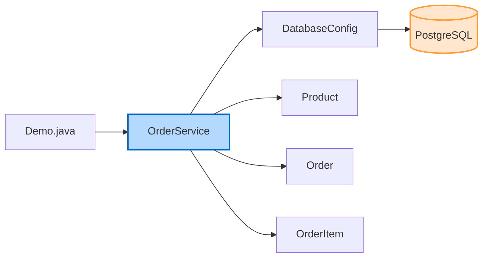

# JDBC Transaction & Batch: "Đặt hàng – Trừ kho"

> **Lab Demo** của nhóm về ứng dụng JDBC Transaction và Batch Processing trong hệ thống quản lý đơn hàng và kho hàng.

---

# 📚 PHẦN A: LÝ THUYẾT

Phần này giới thiệu các khái niệm nền tảng về Transaction và Batch Processing trong JDBC.

## 1. Transaction (Giao dịch)

**Transaction** là một đơn vị công việc (unit of work) bao gồm một hoặc nhiều thao tác cơ sở dữ liệu được thực hiện như một khối không thể phân chia. Tất cả các thao tác trong transaction phải được thực hiện thành công, nếu không sẽ được hoàn tác (rollback).

### 1.1. ACID Properties

Transaction phải đảm bảo 4 tính chất ACID:

| Tính chất | Mô tả | Ví dụ |
|-----------|-------|-------|
| **Atomicity** (Tính nguyên tử) | Tất cả các thao tác trong transaction hoặc được thực hiện hoàn toàn, hoặc không thực hiện gì cả | Chuyển tiền: trừ tài khoản A và cộng tài khoản B phải cùng thành công hoặc cùng thất bại |
| **Consistency** (Tính nhất quán) | Transaction chuyển database từ trạng thái hợp lệ này sang trạng thái hợp lệ khác | Tổng tiền trong hệ thống ngân hàng không thay đổi sau khi chuyển tiền |
| **Isolation** (Tính cô lập) | Các transaction đồng thời không ảnh hưởng lẫn nhau | Transaction A đọc dữ liệu không bị ảnh hưởng bởi Transaction B đang chạy song song |
| **Durability** (Tính bền vững) | Khi transaction đã commit, dữ liệu được lưu vĩnh viễn | Sau khi commit, dữ liệu vẫn tồn tại ngay cả khi hệ thống bị lỗi |

### 1.2. Commit và Rollback

```java
Connection conn = null;
try {
    conn = DriverManager.getConnection(url, user, password);
    conn.setAutoCommit(false); // Tắt auto-commit
    
    // Thực hiện các thao tác
    // ...
    
    conn.commit(); // Xác nhận thay đổi
    
} catch (Exception e) {
    if (conn != null) {
        conn.rollback(); // Hoàn tác tất cả thay đổi
    }
} finally {
    if (conn != null) {
        conn.setAutoCommit(true); // Bật lại auto-commit
        conn.close();
    }
}
```

**Key Points:**
- `commit()`: Xác nhận và lưu vĩnh viễn tất cả thay đổi trong transaction
- `rollback()`: Hoàn tác tất cả thay đổi, đưa database về trạng thái trước khi bắt đầu transaction
- `setAutoCommit(false)`: Tắt chế độ tự động commit, cho phép kiểm soát transaction thủ công

### 1.3. AutoCommit Mode

```java
// AutoCommit = true (mặc định)
// Mỗi câu lệnh SQL được tự động commit ngay sau khi thực hiện
Connection conn = DriverManager.getConnection(url, user, password);
// conn.getAutoCommit() returns true

// AutoCommit = false
// Phải gọi commit() hoặc rollback() thủ công
conn.setAutoCommit(false);
```

> [!WARNING]
> **Khi nào cần tắt AutoCommit?**
> - Khi cần thực hiện nhiều câu lệnh SQL liên quan với nhau
> - Khi cần đảm bảo tính toàn vẹn dữ liệu (data integrity)
> - Khi cần rollback nếu có lỗi xảy ra

## 2. Batch Query (Xử lý hàng loạt)

**Batch Processing** cho phép gửi nhiều câu lệnh SQL cùng lúc đến database server, thay vì gửi từng câu lệnh một.

### 2.1. Khi nào nên dùng Batch?

✅ **Nên dùng khi:**
- Insert/Update/Delete nhiều bản ghi cùng lúc
- Các câu lệnh có cấu trúc tương tự nhau
- Cần tối ưu hiệu năng khi xử lý dữ liệu lớn

❌ **Không nên dùng khi:**
- Chỉ có một hoặc vài câu lệnh đơn giản
- Các câu lệnh phụ thuộc vào kết quả của nhau
- Cần xử lý từng bản ghi riêng biệt với logic phức tạp

### 2.2. Lợi ích của Batch Query

| Lợi ích | Giải thích | Minh họa |
|---------|-----------|----------|
| **Giảm Network Round-trips** | Gửi nhiều câu lệnh trong 1 lần thay vì nhiều lần | 1 request → Server vs 1000 requests → Server |
| **Tăng hiệu năng** | Giảm thời gian thực thi tổng thể | Insert 1000 records: 10s → 0.5s |
| **Giảm tải Server** | Database server xử lý batch hiệu quả hơn | Ít kết nối, ít overhead |
| **Tối ưu Transaction** | Tất cả câu lệnh trong batch có thể dùng chung transaction | Atomicity cho toàn bộ batch |

### 2.3. Cách sử dụng Batch

```java
// Cách 1: Statement Batch
Statement stmt = conn.createStatement();
stmt.addBatch("INSERT INTO products VALUES (1, 'Product A', 100)");
stmt.addBatch("INSERT INTO products VALUES (2, 'Product B', 200)");
stmt.addBatch("INSERT INTO products VALUES (3, 'Product C', 150)");
int[] results = stmt.executeBatch();

// Cách 2: PreparedStatement Batch (Recommended)
String sql = "INSERT INTO products (id, name, stock) VALUES (?, ?, ?)";
PreparedStatement pstmt = conn.prepareStatement(sql);

pstmt.setInt(1, 1);
pstmt.setString(2, "Product A");
pstmt.setInt(3, 100);
pstmt.addBatch();

pstmt.setInt(1, 2);
pstmt.setString(2, "Product B");
pstmt.setInt(3, 200);
pstmt.addBatch();

int[] results = pstmt.executeBatch();
```

> [!TIP]
> **Best Practice:**
> - Sử dụng `PreparedStatement` thay vì `Statement` để tránh SQL Injection
> - Chia batch thành các chunk nhỏ (vd: 500-1000 records/batch) để tránh OutOfMemory
> - Kết hợp Batch với Transaction để đảm bảo tính toàn vẹn

---

# 🧪 PHẦN B: LAB DEMO - HỆ THỐNG ĐẶT HÀNG & TRỪ KHO

## 1. Phân tích Bài toán (Problem Analysis)

### 1.1. Bối cảnh Nghiệp vụ (Business Context)

Trong thực tế, các hệ thống thương mại điện tử (e-commerce) phải xử lý quy trình đặt hàng phức tạp:

- **Thách thức**: Khi khách hàng đặt hàng nhiều sản phẩm, hệ thống phải đảm bảo:
  - ✅ Tất cả sản phẩm đều có sẵn trong kho
  - ✅ Số lượng tồn kho được cập nhật chính xác
  - ✅ Đơn hàng được tạo thành công hoặc không tạo gì cả (không được tạo đơn hàng một phần)
  - ✅ Tránh race condition khi nhiều người đặt cùng lúc

- **Vấn đề**: Nếu không dùng transaction:
  - ❌ Có thể tạo đơn hàng nhưng quên trừ kho
  - ❌ Có thể trừ kho nhưng không tạo được đơn hàng
  - ❌ Có thể trừ kho cho sản phẩm đầu, nhưng sản phẩm sau không đủ → dữ liệu không nhất quán

### 1.2. Yêu cầu Nghiệp vụ (Business Requirements)

| Yêu cầu | Mô tả | Giải pháp kỹ thuật |
|---------|-------|-------------------|
| **BR-01** | Đơn hàng chỉ được tạo khi TẤT CẢ sản phẩm đều đủ số lượng | Transaction với validation trước khi commit |
| **BR-02** | Khi đặt hàng thành công, số lượng tồn kho phải được trừ chính xác | UPDATE stock trong cùng transaction |
| **BR-03** | Nếu bất kỳ sản phẩm nào không đủ, toàn bộ đơn hàng phải bị hủy | Rollback transaction khi có exception |
| **BR-04** | Lưu chi tiết đơn hàng (order items) hiệu quả | Batch insert để tối ưu performance |
| **BR-05** | Dữ liệu phải nhất quán ngay cả khi hệ thống gặp lỗi | ACID compliance |

## 2. Phân tích Use Case

### 2.1. Use Case 1: Đặt hàng Thành công

```
Actor: Khách hàng
Precondition: Tất cả sản phẩm đều có sẵn trong kho với số lượng đủ
Flow:
  1. Khách hàng chọn nhiều sản phẩm vào giỏ hàng
  2. Hệ thống kiểm tra tồn kho từng sản phẩm
  3. Tất cả sản phẩm đều đủ số lượng
  4. Hệ thống tạo đơn hàng mới
  5. Hệ thống trừ kho cho từng sản phẩm
  6. Hệ thống lưu chi tiết đơn hàng (order items)
  7. Hệ thống commit transaction
Postcondition: 
  - Đơn hàng được tạo thành công
  - Tồn kho được cập nhật chính xác
  - Chi tiết đơn hàng được lưu đầy đủ
```

**Ví dụ thực tế:**
```
Khách hàng đặt:
  - 2 chiếc Laptop Dell XPS 15 (Tồn kho: 10 → Sau đặt: 8)
  - 5 chiếc iPhone 15 Pro Max (Tồn kho: 25 → Sau đặt: 20)
  - 10 chiếc AirPods Pro 2 (Tồn kho: 50 → Sau đặt: 40)

Kết quả: ✅ Đặt hàng thành công, Order ID được trả về
```

### 2.2. Use Case 2: Đặt hàng Thất bại (Rollback)

```
Actor: Khách hàng
Precondition: Ít nhất một sản phẩm không đủ số lượng trong kho
Flow:
  1. Khách hàng chọn nhiều sản phẩm vào giỏ hàng
  2. Hệ thống kiểm tra tồn kho từng sản phẩm
  3. Phát hiện sản phẩm X không đủ số lượng
  4. Hệ thống rollback toàn bộ transaction
  5. Hệ thống thông báo lỗi cho khách hàng
Postcondition: 
  - Không có đơn hàng nào được tạo
  - Tồn kho KHÔNG bị thay đổi
  - Database trở về trạng thái ban đầu
```

**Ví dụ thực tế:**
```
Khách hàng đặt:
  - 5 chiếc Samsung Galaxy S24 (Tồn kho: 15 ✅)
  - 20 chiếc iPad Pro 12.9 (Tồn kho: 8 ❌ KHÔNG ĐỦ!)
  - 10 chiếc Sony WH-1000XM5 (Tồn kho: 30 ✅)

Kết quả: ❌ Rollback toàn bộ, tồn kho vẫn giữ nguyên
```

## 3. Cách Tiếp cận Kỹ thuật (Technical Approach)

### 3.1. Kiến trúc Hệ thống



### 3.2. Quyết định Thiết kế

| Vấn đề | Giải pháp | Lý do |
|--------|-----------|-------|
| Làm sao đảm bảo tính toàn vẹn dữ liệu? | Sử dụng Transaction với AutoCommit=false | Tất cả thao tác trong 1 unit of work |
| Khi nào kiểm tra tồn kho? | Kiểm tra TẤT CẢ items TRƯỚC khi trừ kho | Fail fast, tránh lãng phí resources |
| Làm sao tối ưu insert nhiều order items? | Batch Processing | Giảm network round-trips |
| Xử lý lỗi như thế nào? | Try-Catch-Finally với Rollback | Cleanup resources và đảm bảo rollback |

### 3.3. Workflow Chi tiết

```mermaid
flowchart TD
    Start([🚀 START: createOrder]) --> Init[📋 Khởi tạo Connection & PreparedStatements]
    Init --> TryBlock{{"⚡ TRY BLOCK"}}
    
    TryBlock --> Step1[🔓 1. Lấy Connection từ DatabaseConfig]
    Step1 --> Step2[🚫 2. setAutoCommit FALSE<br/>📌 Bắt đầu Transaction]
    Step2 --> Step3[➕ 3. INSERT INTO orders<br/>💾 RETURNING id]
    Step3 --> Step4[📦 4. Chuẩn bị kiểm tra tồn kho<br/>SQL: SELECT FROM products WHERE id = ?]
    
    Step4 --> LoopCheck{{"🔄 FOR EACH<br/>OrderItem"}}
    LoopCheck --> CheckStock[🔍 Query: Lấy stock hiện tại]
    CheckStock --> ProductExists{Sản phẩm<br/>tồn tại?}
    
    ProductExists -->|❌ Không| ThrowNotFound["⚠️ throw Exception<br/>'Không tìm thấy Product'"]
    ThrowNotFound --> CatchBlock
    
    ProductExists -->|✅ Có| CompareStock{stock >= qty?}
    CompareStock -->|❌ Không đủ| ThrowInsufficient["⚠️ throw Exception<br/>'KHÔNG ĐỦ HÀNG!'"]
    ThrowInsufficient --> CatchBlock
    
    CompareStock -->|✅ Đủ| NextItem{Còn item<br/>tiếp theo?}
    NextItem -->|Có| LoopCheck
    NextItem -->|Hết| AllChecked[✓ Tất cả items đều đủ hàng]
    
    AllChecked --> LoopUpdate{{"🔄 FOR EACH<br/>OrderItem"}}
    LoopUpdate --> UpdateStock[📉 UPDATE products<br/>SET stock = stock - qty<br/>WHERE id = ?]
    UpdateStock --> NextUpdate{Còn item<br/>tiếp theo?}
    NextUpdate -->|Có| LoopUpdate
    NextUpdate -->|Hết| AllUpdated[✓ Đã trừ kho xong]
    
    AllUpdated --> BatchPrep[📝 Chuẩn bị Batch Insert<br/>SQL: INSERT INTO order_items]
    BatchPrep --> LoopBatch{{"🔄 FOR EACH<br/>OrderItem"}}
    LoopBatch --> AddToBatch[⬆️ pstmt.setInt 1,2,3<br/>⬆️ pstmt.addBatch]
    AddToBatch --> NextBatch{Còn item<br/>tiếp theo?}
    NextBatch -->|Có| LoopBatch
    NextBatch -->|Hết| ExecuteBatch[🚀 executeBatch<br/>Insert tất cả items cùng lúc]
    
    ExecuteBatch --> Commit[✅ conn.commit<br/>💾 Lưu vĩnh viễn tất cả thay đổi]
    Commit --> ReturnSuccess[🎉 Return orderId]
    ReturnSuccess --> FinallyBlock
    
    TryBlock -.->|Exception| CatchBlock{{"⚠️ CATCH BLOCK"}}
    CatchBlock --> RollbackCheck{conn != null?}
    RollbackCheck -->|Có| Rollback[🔙 conn.rollback<br/>⚠️ Hoàn tác TẤT CẢ thay đổi]
    RollbackCheck -->|Không| ReThrow
    Rollback --> ReThrow[⛔ Re-throw Exception]
    ReThrow --> FinallyBlock
    
    FinallyBlock{{"🧹 FINALLY BLOCK"}}
    FinallyBlock --> CloseResources[🔒 Đóng ResultSet, PreparedStatements]
    CloseResources --> RestoreAutoCommit[🔓 setAutoCommit TRUE<br/>Bật lại chế độ mặc định]
    RestoreAutoCommit --> CloseConn[🔌 conn.close]
    CloseConn --> End([🏁 END])
    
    style Start fill:#e1f5e1
    style End fill:#ffe1e1
    style Commit fill:#b3ffb3,stroke:#00aa00,stroke-width:3px
    style Rollback fill:#ffb3b3,stroke:#ff0000,stroke-width:3px
    style ExecuteBatch fill:#b3d9ff,stroke:#0066cc,stroke-width:2px
    style TryBlock fill:#fff9e6,stroke:#ffcc00,stroke-width:2px
    style CatchBlock fill:#ffe6e6,stroke:#ff6666,stroke-width:2px
    style FinallyBlock fill:#e6f3ff,stroke:#6699ff,stroke-width:2px
    style ThrowNotFound fill:#ffcccc
    style ThrowInsufficient fill:#ffcccc
```



#### 📌 Giải thích các bước quan trọng:

| Bước | Mô tả | ACID Property | Mục đích |
|------|-------|---------------|----------|
| **1-2** | Lấy Connection và tắt AutoCommit | - | Bắt đầu transaction thủ công |
| **3** | Insert Order và lấy ID | Atomicity | Tạo đơn hàng mới, lấy ID để dùng cho items |
| **4-5** | Loop kiểm tra tồn kho cho TẤT CẢ items | Consistency | Validate TRƯỚC khi thực hiện thay đổi (fail fast) |
| **6** | Loop trừ kho từng sản phẩm | Atomicity, Consistency | Update stock, đảm bảo consistency |
| **7-8** | Batch Insert order_items | Atomicity | Insert hiệu quả, tất cả items trong 1 batch |
| **9** | Commit transaction | Durability | Xác nhận và lưu vĩnh viễn TẤT CẢ thay đổi |
| **Catch** | Rollback nếu có lỗi | Atomicity | Hoàn tác TẤT CẢ nếu có bất kỳ lỗi nào |
| **Finally** | Cleanup resources | - | Đóng connections, restore AutoCommit |

### 3.4. Áp dụng ACID Properties

| Property | Cách áp dụng trong Lab |
|----------|----------------------|
| **Atomicity** | Tất cả thao tác (create order + deduct stock + insert items) trong 1 transaction. Hoặc tất cả thành công, hoặc tất cả rollback. |
| **Consistency** | Kiểm tra constraint: `stock >= 0` và `qty > 0`. Transaction chuyển DB từ trạng thái hợp lệ sang trạng thái hợp lệ khác. |
| **Isolation** | Mỗi connection có transaction riêng, không ảnh hưởng lẫn nhau (PostgreSQL mặc định: READ COMMITTED). |
| **Durability** | Sau khi `commit()`, dữ liệu được lưu vĩnh viễn vào PostgreSQL, không mất ngay cả khi crash. |

## 4. Database Schema

```sql
-- Bảng sản phẩm
CREATE TABLE products (
    id SERIAL PRIMARY KEY,
    name VARCHAR(255) NOT NULL,
    stock INTEGER NOT NULL CHECK (stock >= 0),  -- Constraint: tồn kho không âm
    created_at TIMESTAMP DEFAULT CURRENT_TIMESTAMP,
    updated_at TIMESTAMP DEFAULT CURRENT_TIMESTAMP
);

-- Bảng đơn hàng
CREATE TABLE orders (
    id SERIAL PRIMARY KEY,
    created_at TIMESTAMP DEFAULT CURRENT_TIMESTAMP
);

-- Bảng chi tiết đơn hàng (Many-to-Many relationship)
CREATE TABLE order_items (
    order_id INTEGER NOT NULL,
    product_id INTEGER NOT NULL,
    qty INTEGER NOT NULL CHECK (qty > 0),  -- Constraint: số lượng phải > 0
    PRIMARY KEY (order_id, product_id),
    FOREIGN KEY (order_id) REFERENCES orders(id) ON DELETE CASCADE,
    FOREIGN KEY (product_id) REFERENCES products(id) ON DELETE CASCADE
);

-- Index để tối ưu query
CREATE INDEX idx_order_items_order_id ON order_items(order_id);
CREATE INDEX idx_order_items_product_id ON order_items(product_id);
```

**Thiết kế Database:**
- ✅ Normalized (3NF): Tránh data redundancy
- ✅ Foreign Keys: Đảm bảo referential integrity
- ✅ Check Constraints: Validate data tại database level
- ✅ Indexes: Tối ưu query performance

## 5. Cấu trúc Project

```
jdbc-transaction-batch/
├── database/
│   └── schema.sql              # Database schema + sample data
├── src/
│   ├── config/
│   │   └── DatabaseConfig.java # Singleton pattern - Quản lý connection
│   ├── model/
│   │   ├── Product.java        # Entity: Sản phẩm
│   │   ├── Order.java          # Entity: Đơn hàng
│   │   └── OrderItem.java      # Entity: Chi tiết đơn hàng
│   ├── service/
│   │   └── OrderService.java   # Business logic - Transaction & Batch
│   └── Demo.java               # Main class - 2 test cases
├── pom.xml                     # Maven dependencies
└── README.md                   # Documentation
```

## 6. Các Tính năng Chính (Key Features)

> [!IMPORTANT]
> **Transaction Management (Quản lý giao dịch):**
> - ✅ Tất cả thao tác nằm trong 1 transaction (create order, check stock, deduct stock, insert items)
> - ✅ Kiểm tra TẤT CẢ items TRƯỚC khi thực hiện thay đổi (fail fast strategy)
> - ✅ Rollback toàn bộ nếu bất kỳ bước nào thất bại
> - ✅ Đảm bảo ACID properties

> [!IMPORTANT]
> **Batch Processing (Xử lý hàng loạt):**
> - ✅ Insert tất cả order_items trong 1 batch duy nhất
> - ✅ Sử dụng `PreparedStatement.addBatch()` và `executeBatch()`
> - ✅ Giảm network overhead (1 round-trip thay vì N round-trips)
> - ✅ Tăng hiệu năng đáng kể khi có nhiều items

> [!TIP]
> **Best Practices được áp dụng:**
> - ✅ Singleton pattern cho DatabaseConfig
> - ✅ PreparedStatement để tránh SQL Injection
> - ✅ Try-with-resources hoặc explicit cleanup trong finally
> - ✅ Validation trước khi thực hiện thay đổi
> - ✅ Clear error messages với context

## 7. Demo Cases (Kịch bản Demo)

### 7.1. Case 1: Đặt hàng THÀNH CÔNG ✅

**Input:**
```java
Order order = new Order();
order.addItem(1, 2);   // Laptop Dell XPS 15: 2 chiếc (Stock: 10)
order.addItem(2, 5);   // iPhone 15 Pro Max: 5 chiếc (Stock: 25)
order.addItem(4, 10);  // AirPods Pro 2: 10 chiếc (Stock: 50)
```

**Expected Output:**
```
═══════════════════════════════════════════════════
🔄 Bắt đầu Transaction
═══════════════════════════════════════════════════
✓ Đã tạo Order ID: 1

📦 Kiểm tra tồn kho:
  - Product ID 1 (Laptop Dell XPS 15): Tồn kho = 10, Cần = 2
  - Product ID 2 (iPhone 15 Pro Max): Tồn kho = 25, Cần = 5
  - Product ID 4 (AirPods Pro 2): Tồn kho = 50, Cần = 10
✓ Tất cả sản phẩm đều đủ hàng

📉 Trừ kho:
  ✓ Product ID 1: Trừ 2 sản phẩm
  ✓ Product ID 2: Trừ 5 sản phẩm
  ✓ Product ID 4: Trừ 10 sản phẩm

📝 Insert Order Items (Batch Processing):
  + Batch: Order ID 1, Product ID 1, Qty 2
  + Batch: Order ID 1, Product ID 2, Qty 5
  + Batch: Order ID 1, Product ID 4, Qty 10
✓ Đã insert 3 order items bằng batch

✅ COMMIT TRANSACTION - Đơn hàng đã được tạo thành công!
═══════════════════════════════════════════════════
```

**Verification:**
- Order ID 1 được tạo trong bảng `orders`
- 3 records được thêm vào bảng `order_items`
- Tồn kho được cập nhật: Laptop (10→8), iPhone (25→20), AirPods (50→40)

### 7.2. Case 2: Đặt hàng THẤT BẠI (Rollback) ❌

**Input:**
```java
Order order = new Order();
order.addItem(3, 5);   // Samsung Galaxy S24: 5 chiếc (Stock: 15) ✓
order.addItem(5, 20);  // iPad Pro 12.9: 20 chiếc (Stock: 8) ✗ KHÔNG ĐỦ!
order.addItem(7, 10);  // Sony WH-1000XM5: 10 chiếc (Stock: 30) ✓
```

**Expected Output:**
```
═══════════════════════════════════════════════════
🔄 Bắt đầu Transaction
═══════════════════════════════════════════════════
✓ Đã tạo Order ID: 2

📦 Kiểm tra tồn kho:
  - Product ID 3 (Samsung Galaxy S24): Tồn kho = 15, Cần = 5
  - Product ID 5 (iPad Pro 12.9): Tồn kho = 8, Cần = 20
❌ KHÔNG ĐỦ HÀNG! Product 'iPad Pro 12.9' (ID: 5) - Tồn kho: 8, Yêu cầu: 20

🔙 ROLLBACK TRANSACTION - Đã hoàn tác tất cả thay đổi
═══════════════════════════════════════════════════

❌ KẾT QUẢ: Đơn hàng thất bại

💡 Giải thích:
  - Transaction đã được ROLLBACK
  - Tất cả thay đổi đã được hoàn tác
  - Tồn kho KHÔNG bị ảnh hưởng
```

**Verification:**
- KHÔNG có Order ID 2 trong bảng `orders`
- KHÔNG có records nào được thêm vào `order_items`
- Tồn kho VẪN NGUYÊN: Samsung (15), iPad (8), Sony (30)

## 8. Hướng dẫn Chạy Demo

### Bước 1: Setup Database

```bash
# Tạo database PostgreSQL
createdb order_system

# Chạy schema để tạo tables và insert sample data
psql -U postgres -d order_system -f database/schema.sql
```

### Bước 2: Cấu hình Database Connection

Mở `src/config/DatabaseConfig.java` và điều chỉnh:

```java
private static final String URL = "jdbc:postgresql://localhost:5432/order_system";
private static final String USER = "postgres";
private static final String PASSWORD = "your_password";
```

### Bước 3: Build & Run

```bash
# Di chuyển vào thư mục project
cd jdbc-transaction-batch

# Compile code
mvn clean compile

# Chạy demo
mvn exec:java -Dexec.mainClass="Demo"
```

hoặc sử dụng IDE (IntelliJ IDEA, Eclipse):
1. Import project as Maven project
2. Run `Demo.java` as Java Application

## 9. Kết luận & Bài học

### 9.1. Transaction trong thực tế

✅ **Cần dùng Transaction khi:**
- Nhiều thao tác phụ thuộc lẫn nhau (vd: chuyển tiền, đặt hàng-trừ kho, booking tickets)
- Cần đảm bảo tính toàn vẹn dữ liệu (data integrity)
- Có khả năng rollback khi lỗi
- Thao tác liên quan đến nhiều tables

❌ **Không cần Transaction khi:**
- Chỉ có 1 câu lệnh SQL đơn giản (đã atomic by default)
- Các thao tác độc lập, không liên quan đến nhau
- Read-only queries

### 9.2. Batch Processing trong thực tế

✅ **Cần dùng Batch khi:**
- Insert/Update/Delete nhiều bản ghi (từ hàng chục đến hàng triệu records)
- Các câu lệnh có cấu trúc giống nhau
- Cần tối ưu hiệu năng (import data, bulk operations)
- Trong ETL processes

❌ **Không cần Batch khi:**
- Chỉ có 1-2 records
- Các câu lệnh phụ thuộc vào kết quả của nhau
- Cần xử lý từng record với logic phức tạp riêng biệt

### 9.3. Best Practices

1. **Always use PreparedStatement** để tránh SQL Injection
2. **Combine Transaction + Batch** cho các thao tác phức tạp với nhiều records
3. **Handle exceptions properly** và luôn rollback khi có lỗi
4. **Close resources** trong `finally` hoặc dùng try-with-resources
5. **Set appropriate isolation levels** nếu cần (READ_COMMITTED, SERIALIZABLE, etc.)
6. **Fail fast strategy**: Validate TẤT CẢ trước khi thực hiện thay đổi
7. **Use connection pooling** trong production (HikariCP, C3P0, etc.)

### 9.4. Điểm nổi bật của Lab

✨ **Điểm mạnh:**
- Tích hợp cả Transaction và Batch Processing trong 1 use case thực tế
- Áp dụng đầy đủ ACID properties
- Clear separation of concerns (Config, Model, Service, Demo)
- Comprehensive error handling với rollback
- Detailed logging để dễ debug và hiểu flow

🎯 **Kỹ năng học được:**
- Quản lý Transaction trong JDBC
- Sử dụng Batch Processing hiệu quả
- Thiết kế database schema chuẩn
- Xử lý exceptions và rollback
- Design patterns (Singleton)

---

## Tài liệu tham khảo

- [Oracle JDBC Transaction Tutorial](https://docs.oracle.com/javase/tutorial/jdbc/basics/transactions.html)
- [JDBC Batch Processing](https://docs.oracle.com/javase/tutorial/jdbc/basics/prepared.html#batch_updates)
- [ACID Properties](https://en.wikipedia.org/wiki/ACID)
- [PostgreSQL Documentation](https://www.postgresql.org/docs/current/)
- [Maven Getting Started](https://maven.apache.org/guides/getting-started/)
