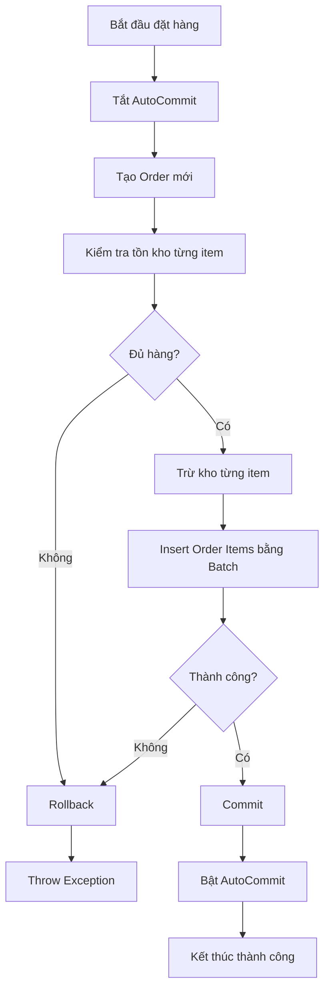

# JDBC Transaction & Batch: "Đặt hàng – Trừ kho"

## A. Lý Thuyết (Theory)

### 1. Transaction (Giao dịch)

**Transaction** là một đơn vị công việc (unit of work) bao gồm một hoặc nhiều thao tác cơ sở dữ liệu được thực hiện như một khối không thể phân chia. Tất cả các thao tác trong transaction phải được thực hiện thành công, nếu không sẽ được hoàn tác (rollback).

#### ACID Properties

Transaction phải đảm bảo 4 tính chất ACID:

| Tính chất | Mô tả | Ví dụ |
|-----------|-------|-------|
| **Atomicity** (Tính nguyên tử) | Tất cả các thao tác trong transaction hoặc được thực hiện hoàn toàn, hoặc không thực hiện gì cả | Chuyển tiền: trừ tài khoản A và cộng tài khoản B phải cùng thành công hoặc cùng thất bại |
| **Consistency** (Tính nhất quán) | Transaction chuyển database từ trạng thái hợp lệ này sang trạng thái hợp lệ khác | Tổng tiền trong hệ thống ngân hàng không thay đổi sau khi chuyển tiền |
| **Isolation** (Tính cô lập) | Các transaction đồng thời không ảnh hưởng lẫn nhau | Transaction A đọc dữ liệu không bị ảnh hưởng bởi Transaction B đang chạy song song |
| **Durability** (Tính bền vững) | Khi transaction đã commit, dữ liệu được lưu vĩnh viễn | Sau khi commit, dữ liệu vẫn tồn tại ngay cả khi hệ thống bị lỗi |

#### Commit và Rollback

```java
Connection conn = null;
try {
    conn = DriverManager.getConnection(url, user, password);
    conn.setAutoCommit(false); // Tắt auto-commit
    
    // Thực hiện các thao tác
    // ...
    
    conn.commit(); // Xác nhận thay đổi
    
} catch (Exception e) {
    if (conn != null) {
        conn.rollback(); // Hoàn tác tất cả thay đổi
    }
} finally {
    if (conn != null) {
        conn.setAutoCommit(true); // Bật lại auto-commit
        conn.close();
    }
}
```

**Key Points:**
- `commit()`: Xác nhận và lưu vĩnh viễn tất cả thay đổi trong transaction
- `rollback()`: Hoàn tác tất cả thay đổi, đưa database về trạng thái trước khi bắt đầu transaction
- `setAutoCommit(false)`: Tắt chế độ tự động commit, cho phép kiểm soát transaction thủ công

#### AutoCommit Mode

```java
// AutoCommit = true (mặc định)
// Mỗi câu lệnh SQL được tự động commit ngay sau khi thực hiện
Connection conn = DriverManager.getConnection(url, user, password);
// conn.getAutoCommit() returns true

// AutoCommit = false
// Phải gọi commit() hoặc rollback() thủ công
conn.setAutoCommit(false);
```

> [!WARNING]
> **Khi nào cần tắt AutoCommit?**
> - Khi cần thực hiện nhiều câu lệnh SQL liên quan với nhau
> - Khi cần đảm bảo tính toàn vẹn dữ liệu (data integrity)
> - Khi cần rollback nếu có lỗi xảy ra

### 2. Batch Query (Xử lý hàng loạt)

**Batch Processing** cho phép gửi nhiều câu lệnh SQL cùng lúc đến database server, thay vì gửi từng câu lệnh một.

#### Khi nào nên dùng Batch?

✅ **Nên dùng khi:**
- Insert/Update/Delete nhiều bản ghi cùng lúc
- Các câu lệnh có cấu trúc tương tự nhau
- Cần tối ưu hiệu năng khi xử lý dữ liệu lớn

❌ **Không nên dùng khi:**
- Chỉ có một hoặc vài câu lệnh đơn giản
- Các câu lệnh phụ thuộc vào kết quả của nhau
- Cần xử lý từng bản ghi riêng biệt với logic phức tạp

#### Lợi ích của Batch Query

| Lợi ích | Giải thích | Minh họa |
|---------|-----------|----------|
| **Giảm Network Round-trips** | Gửi nhiều câu lệnh trong 1 lần thay vì nhiều lần | 1 request → Server vs 1000 requests → Server |
| **Tăng hiệu năng** | Giảm thời gian thực thi tổng thể | Insert 1000 records: 10s → 0.5s |
| **Giảm tải Server** | Database server xử lý batch hiệu quả hơn | Ít kết nối, ít overhead |
| **Tối ưu Transaction** | Tất cả câu lệnh trong batch có thể dùng chung transaction | Atomicity cho toàn bộ batch |

#### Cách sử dụng Batch

```java
// Cách 1: Statement Batch
Statement stmt = conn.createStatement();
stmt.addBatch("INSERT INTO products VALUES (1, 'Product A', 100)");
stmt.addBatch("INSERT INTO products VALUES (2, 'Product B', 200)");
stmt.addBatch("INSERT INTO products VALUES (3, 'Product C', 150)");
int[] results = stmt.executeBatch();

// Cách 2: PreparedStatement Batch (Recommended)
String sql = "INSERT INTO products (id, name, stock) VALUES (?, ?, ?)";
PreparedStatement pstmt = conn.prepareStatement(sql);

pstmt.setInt(1, 1);
pstmt.setString(2, "Product A");
pstmt.setInt(3, 100);
pstmt.addBatch();

pstmt.setInt(1, 2);
pstmt.setString(2, "Product B");
pstmt.setInt(3, 200);
pstmt.addBatch();

int[] results = pstmt.executeBatch();
```

> [!TIP]
> **Best Practice:**
> - Sử dụng `PreparedStatement` thay vì `Statement` để tránh SQL Injection
> - Chia batch thành các chunk nhỏ (vd: 500-1000 records/batch) để tránh OutOfMemory
> - Kết hợp Batch với Transaction để đảm bảo tính toàn vẹn

---

## B. Lab: Hệ thống Đặt hàng - Trừ kho

### Mô tả bài toán

Xây dựng hệ thống đặt hàng với các yêu cầu:

1. **Database Schema:**
   - `products`: Lưu thông tin sản phẩm và số lượng tồn kho
   - `orders`: Lưu thông tin đơn hàng
   - `order_items`: Chi tiết đơn hàng (order_id, product_id, qty)

2. **Business Logic:**
   - Khi tạo order mới, trừ kho theo từng item
   - Nếu bất kỳ item nào không đủ hàng → rollback toàn bộ
   - Insert order_items sử dụng batch processing

3. **Demo Cases:**
   - ✅ Case 1: Đặt hàng thành công (đủ hàng trong kho)
   - ❌ Case 2: Đặt hàng thất bại (không đủ hàng → rollback)

### Database Schema

```sql
-- Bảng sản phẩm
CREATE TABLE products (
    id SERIAL PRIMARY KEY,
    name VARCHAR(255) NOT NULL,
    stock INTEGER NOT NULL CHECK (stock >= 0)
);

-- Bảng đơn hàng
CREATE TABLE orders (
    id SERIAL PRIMARY KEY,
    created_at TIMESTAMP DEFAULT CURRENT_TIMESTAMP
);

-- Bảng chi tiết đơn hàng
CREATE TABLE order_items (
    order_id INTEGER NOT NULL,
    product_id INTEGER NOT NULL,
    qty INTEGER NOT NULL CHECK (qty > 0),
    PRIMARY KEY (order_id, product_id),
    FOREIGN KEY (order_id) REFERENCES orders(id) ON DELETE CASCADE,
    FOREIGN KEY (product_id) REFERENCES products(id) ON DELETE CASCADE
);
```

### Implementation Workflow



### Project Structure

```
jdbc-transaction-batch/
├── database/
│   └── schema.sql              # Database schema
├── src/
│   ├── config/
│   │   └── DatabaseConfig.java # Database connection
│   ├── model/
│   │   ├── Product.java
│   │   ├── Order.java
│   │   └── OrderItem.java
│   ├── service/
│   │   └── OrderService.java   # Business logic
│   └── Demo.java               # Demo cases
└── README.md
```

### Key Features

> [!IMPORTANT]
> **Transaction Management:**
> - Tất cả thao tác (create order, check stock, deduct stock, insert items) nằm trong 1 transaction
> - Nếu bất kỳ bước nào thất bại → rollback toàn bộ
> - Đảm bảo tính toàn vẹn dữ liệu

> [!IMPORTANT]
> **Batch Processing:**
> - Insert tất cả order_items trong 1 batch
> - Giảm network overhead
> - Tăng hiệu năng khi có nhiều items

---

## Kết luận

### Khi nào dùng Transaction?

✅ **Cần dùng khi:**
- Nhiều thao tác phụ thuộc lẫn nhau (vd: chuyển tiền, đặt hàng-trừ kho)
- Cần đảm bảo tính toàn vẹn dữ liệu
- Có khả năng rollback khi lỗi

### Khi nào dùng Batch?

✅ **Cần dùng khi:**
- Insert/Update/Delete nhiều bản ghi
- Các câu lệnh có cấu trúc giống nhau
- Cần tối ưu hiệu năng

### Best Practices

1. **Always use PreparedStatement** để tránh SQL Injection
2. **Combine Transaction + Batch** cho các thao tác phức tạp
3. **Handle exceptions properly** và luôn rollback khi có lỗi
4. **Close resources** trong `finally` hoặc dùng try-with-resources
5. **Set appropriate isolation levels** nếu cần (READ_COMMITTED, SERIALIZABLE, etc.)

---

## Tài liệu tham khảo

- [Oracle JDBC Transaction Tutorial](https://docs.oracle.com/javase/tutorial/jdbc/basics/transactions.html)
- [JDBC Batch Processing](https://docs.oracle.com/javase/tutorial/jdbc/basics/prepared.html#batch_updates)
- [ACID Properties](https://en.wikipedia.org/wiki/ACID)
